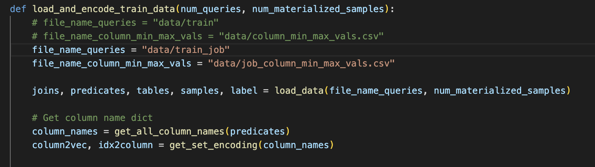
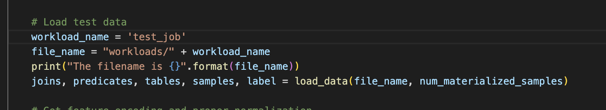
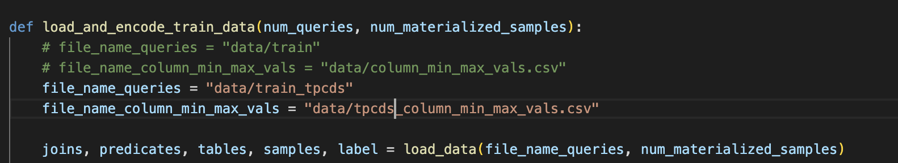
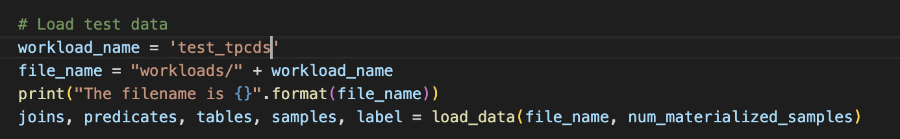

Learned Cardinalities in PyTorch
====

PyTorch implementation of multi-set convolutional networks (MSCNs) to estimate the result sizes of SQL queries [1, 2].

## Requirements

  * PyTorch 1.0
  * Python 3.7

## Usage

```python3 train.py --help```

Example usage:

```python3 train.py synthetic```

To reproduce the results in [1] use:

```python3 train.py --queries 100000 --epochs 100 synthetic```

```python3 train.py --queries 100000 --epochs 100 scale```

```python3 train.py --queries 100000 --epochs 100 job-light```

LearnedWMP usage:

1) Execute join_feature_extractor.py to only perform feature extraction for join operators. The script outputs train_tpcds.csv  contains the featurized queries.

```python3 join_feature_extractor.py ```


Finally, from 1)  you need to know # of queries to execute train.py. Afterwards you need make an edit in data.py and replace the filepath for the 
variables ** **file_name_queries** and **file_name_column_min_max_vals**. Lastly, in the train.py, the variable **workload_name** needs to match the dataset type used in **file_name_queries**. 

For JOB dataset 
```python3 train.py --queries 2227 --epochs 5 test_job```




For TPCDS dataset 
```python3 train.py --queries 99 --epochs 10 test_tpcds```





## References

[1] [Kipf et al., Learned Cardinalities: Estimating Correlated Joins with Deep Learning, 2018](https://arxiv.org/abs/1809.00677)

[2] [Kipf et al., Estimating Cardinalities with Deep Sketches, 2019](https://arxiv.org/abs/1904.08223)

## Cite

Please cite our paper if you use this code in your own work:

```
@article{kipf2018learned,
  title={Learned cardinalities: Estimating correlated joins with deep learning},
  author={Kipf, Andreas and Kipf, Thomas and Radke, Bernhard and Leis, Viktor and Boncz, Peter and Kemper, Alfons},
  journal={arXiv preprint arXiv:1809.00677},
  year={2018}
}
```
